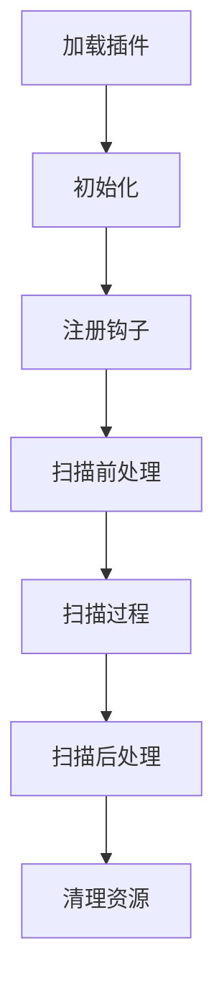

# 🔌 插件开发

本章节介绍如何为 Api-Finder 开发自定义插件。

## 📋 插件系统概述

Api-Finder 提供了强大的插件系统，允许开发者扩展工具的功能。插件可以：

- 🔍 自定义扫描逻辑
- 📊 处理和分析结果
- 🌐 集成第三方服务
- 📝 自定义输出格式
- 🔐 实现认证机制

## 🏗️ 插件架构

### 插件生命周期



### 钩子系统

Api-Finder 提供以下钩子点：

| 钩子名称 | 触发时机 | 参数 | 返回值 |
|----------|----------|------|--------|
| `pre_scan` | 扫描开始前 | target, options | None |
| `post_scan` | 扫描完成后 | result | None |
| `pre_request` | 发送请求前 | url, method, headers | 修改后的参数 |
| `post_request` | 收到响应后 | response | 处理后的响应 |
| `endpoint_found` | 发现端点时 | endpoint | 修改后的端点 |
| `scan_error` | 扫描出错时 | error | None |

## 🚀 快速开始

### 1. 创建基础插件

```python
# plugins/my_plugin.py
from api_finder.plugins import Plugin

class MyPlugin(Plugin):
    def __init__(self):
        super().__init__(
            name="my_plugin",
            version="1.0.0",
            description="我的第一个插件"
        )
    
    def initialize(self, config):
        """插件初始化"""
        self.config = config
        self.logger = self.get_logger()
        self.logger.info("MyPlugin 初始化完成")
    
    def pre_scan(self, target, options):
        """扫描前处理"""
        self.logger.info(f"开始扫描目标: {target}")
    
    def post_scan(self, result):
        """扫描后处理"""
        endpoint_count = len(result.endpoints)
        self.logger.info(f"扫描完成，发现 {endpoint_count} 个端点")

# 插件入口点
def create_plugin():
    return MyPlugin()
```

### 2. 注册插件

```python
# 在主程序中注册插件
from api_finder.plugins import PluginManager

plugin_manager = PluginManager()
plugin_manager.load_plugin("plugins/my_plugin.py")
plugin_manager.enable_plugin("my_plugin")
```

### 3. 配置插件

```yaml
# config/plugins.yaml
plugins:
  my_plugin:
    enabled: true
    config:
      log_level: "INFO"
      custom_option: "value"
```

## 🔧 插件开发指南

### Plugin 基类

```python
from api_finder.plugins import Plugin
from api_finder.utils import Logger

class Plugin:
    def __init__(self, name: str, version: str = "1.0.0", description: str = ""):
        self.name = name
        self.version = version
        self.description = description
        self.enabled = True
        self.config = {}
        self.logger = None
    
    def get_logger(self) -> Logger:
        """获取日志记录器"""
        if not self.logger:
            self.logger = Logger(f"plugin.{self.name}")
        return self.logger
    
    def initialize(self, config: dict):
        """初始化插件（必须实现）"""
        raise NotImplementedError
    
    def cleanup(self):
        """清理资源"""
        pass
    
    # 钩子方法（可选实现）
    def pre_scan(self, target: str, options: dict):
        pass
    
    def post_scan(self, result):
        pass
    
    def pre_request(self, url: str, method: str, headers: dict):
        return url, method, headers
    
    def post_request(self, response):
        return response
    
    def endpoint_found(self, endpoint):
        return endpoint
    
    def scan_error(self, error):
        pass
```

### 配置管理

```python
class ConfigurablePlugin(Plugin):
    def __init__(self):
        super().__init__("configurable_plugin", "1.0.0")
        self.default_config = {
            "timeout": 30,
            "retries": 3,
            "custom_headers": {}
        }
    
    def initialize(self, config):
        # 合并默认配置和用户配置
        self.config = {**self.default_config, **config}
        
        # 验证配置
        self.validate_config()
        
        self.logger = self.get_logger()
        self.logger.info("插件配置加载完成")
    
    def validate_config(self):
        """验证配置"""
        if self.config["timeout"] <= 0:
            raise ValueError("timeout 必须大于 0")
        
        if self.config["retries"] < 0:
            raise ValueError("retries 不能小于 0")
```

## 📊 实用插件示例

### 1. 认证插件

```python
# plugins/auth_plugin.py
import base64
from api_finder.plugins import Plugin

class AuthPlugin(Plugin):
    def __init__(self):
        super().__init__(
            name="auth_plugin",
            version="1.0.0",
            description="HTTP 认证插件"
        )
    
    def initialize(self, config):
        self.config = config
        self.auth_type = config.get("auth_type", "basic")
        self.username = config.get("username", "")
        self.password = config.get("password", "")
        self.token = config.get("token", "")
        self.logger = self.get_logger()
    
    def pre_request(self, url, method, headers):
        """在请求前添加认证信息"""
        if self.auth_type == "basic" and self.username and self.password:
            # Basic 认证
            credentials = f"{self.username}:{self.password}"
            encoded = base64.b64encode(credentials.encode()).decode()
            headers["Authorization"] = f"Basic {encoded}"
            
        elif self.auth_type == "bearer" and self.token:
            # Bearer Token 认证
            headers["Authorization"] = f"Bearer {self.token}"
            
        elif self.auth_type == "api_key" and self.token:
            # API Key 认证
            api_key_header = self.config.get("api_key_header", "X-API-Key")
            headers[api_key_header] = self.token
        
        self.logger.debug(f"已添加 {self.auth_type} 认证信息")
        return url, method, headers

def create_plugin():
    return AuthPlugin()
```

### 2. 结果过滤插件

```python
# plugins/filter_plugin.py
from api_finder.plugins import Plugin

class FilterPlugin(Plugin):
    def __init__(self):
        super().__init__(
            name="filter_plugin",
            version="1.0.0",
            description="结果过滤插件"
        )
    
    def initialize(self, config):
        self.config = config
        self.status_codes = config.get("allowed_status_codes", [200, 201, 202])
        self.min_content_length = config.get("min_content_length", 0)
        self.exclude_extensions = config.get("exclude_extensions", [".css", ".js", ".png"])
        self.logger = self.get_logger()
    
    def endpoint_found(self, endpoint):
        """过滤发现的端点"""
        # 状态码过滤
        if endpoint.status_code not in self.status_codes:
            self.logger.debug(f"过滤端点 {endpoint.url} - 状态码: {endpoint.status_code}")
            return None
        
        # 内容长度过滤
        if endpoint.content_length < self.min_content_length:
            self.logger.debug(f"过滤端点 {endpoint.url} - 内容长度: {endpoint.content_length}")
            return None
        
        # 文件扩展名过滤
        for ext in self.exclude_extensions:
            if endpoint.url.endswith(ext):
                self.logger.debug(f"过滤端点 {endpoint.url} - 扩展名: {ext}")
                return None
        
        return endpoint

def create_plugin():
    return FilterPlugin()
```

### 3. 通知插件

```python
# plugins/notification_plugin.py
import requests
from api_finder.plugins import Plugin

class NotificationPlugin(Plugin):
    def __init__(self):
        super().__init__(
            name="notification_plugin",
            version="1.0.0",
            description="扫描完成通知插件"
        )
    
    def initialize(self, config):
        self.config = config
        self.webhook_url = config.get("webhook_url", "")
        self.email_config = config.get("email", {})
        self.slack_config = config.get("slack", {})
        self.logger = self.get_logger()
    
    def post_scan(self, result):
        """扫描完成后发送通知"""
        message = self.create_message(result)
        
        # Webhook 通知
        if self.webhook_url:
            self.send_webhook(message)
        
        # Slack 通知
        if self.slack_config.get("enabled"):
            self.send_slack(message)
        
        # 邮件通知
        if self.email_config.get("enabled"):
            self.send_email(message)
    
    def create_message(self, result):
        """创建通知消息"""
        endpoint_count = len(result.endpoints)
        duration = result.statistics.get("duration", 0)
        
        return {
            "title": "Api-Finder 扫描完成",
            "message": f"发现 {endpoint_count} 个 API 端点",
            "details": {
                "endpoints": endpoint_count,
                "duration": f"{duration:.2f} 秒",
                "success_rate": f"{result.statistics.get('success_rate', 0):.1%}"
            }
        }
    
    def send_webhook(self, message):
        """发送 Webhook 通知"""
        try:
            response = requests.post(self.webhook_url, json=message, timeout=10)
            response.raise_for_status()
            self.logger.info("Webhook 通知发送成功")
        except Exception as e:
            self.logger.error(f"Webhook 通知发送失败: {e}")
    
    def send_slack(self, message):
        """发送 Slack 通知"""
        try:
            slack_url = self.slack_config["webhook_url"]
            slack_message = {
                "text": message["title"],
                "attachments": [{
                    "color": "good",
                    "fields": [
                        {"title": "端点数量", "value": message["details"]["endpoints"], "short": True},
                        {"title": "扫描时间", "value": message["details"]["duration"], "short": True},
                        {"title": "成功率", "value": message["details"]["success_rate"], "short": True}
                    ]
                }]
            }
            
            response = requests.post(slack_url, json=slack_message, timeout=10)
            response.raise_for_status()
            self.logger.info("Slack 通知发送成功")
        except Exception as e:
            self.logger.error(f"Slack 通知发送失败: {e}")

def create_plugin():
    return NotificationPlugin()
```

### 4. 数据库存储插件

```python
# plugins/database_plugin.py
import sqlite3
from datetime import datetime
from api_finder.plugins import Plugin

class DatabasePlugin(Plugin):
    def __init__(self):
        super().__init__(
            name="database_plugin",
            version="1.0.0",
            description="数据库存储插件"
        )
    
    def initialize(self, config):
        self.config = config
        self.db_path = config.get("db_path", "api_finder.db")
        self.logger = self.get_logger()
        self.init_database()
    
    def init_database(self):
        """初始化数据库"""
        conn = sqlite3.connect(self.db_path)
        cursor = conn.cursor()
        
        # 创建扫描记录表
        cursor.execute("""
            CREATE TABLE IF NOT EXISTS scans (
                id INTEGER PRIMARY KEY AUTOINCREMENT,
                target TEXT NOT NULL,
                start_time TIMESTAMP,
                end_time TIMESTAMP,
                endpoint_count INTEGER,
                status TEXT
            )
        """)
        
        # 创建端点表
        cursor.execute("""
            CREATE TABLE IF NOT EXISTS endpoints (
                id INTEGER PRIMARY KEY AUTOINCREMENT,
                scan_id INTEGER,
                url TEXT NOT NULL,
                method TEXT,
                status_code INTEGER,
                response_time REAL,
                content_length INTEGER,
                discovered_at TIMESTAMP,
                FOREIGN KEY (scan_id) REFERENCES scans (id)
            )
        """)
        
        conn.commit()
        conn.close()
        self.logger.info("数据库初始化完成")
    
    def pre_scan(self, target, options):
        """扫描开始时记录"""
        conn = sqlite3.connect(self.db_path)
        cursor = conn.cursor()
        
        cursor.execute("""
            INSERT INTO scans (target, start_time, status)
            VALUES (?, ?, ?)
        """, (target, datetime.now(), "running"))
        
        self.scan_id = cursor.lastrowid
        conn.commit()
        conn.close()
        
        self.logger.info(f"扫描记录已创建，ID: {self.scan_id}")
    
    def endpoint_found(self, endpoint):
        """发现端点时记录"""
        conn = sqlite3.connect(self.db_path)
        cursor = conn.cursor()
        
        cursor.execute("""
            INSERT INTO endpoints (
                scan_id, url, method, status_code, 
                response_time, content_length, discovered_at
            ) VALUES (?, ?, ?, ?, ?, ?, ?)
        """, (
            self.scan_id,
            endpoint.url,
            endpoint.method,
            endpoint.status_code,
            endpoint.response_time,
            endpoint.content_length,
            datetime.now()
        ))
        
        conn.commit()
        conn.close()
        
        return endpoint
    
    def post_scan(self, result):
        """扫描完成时更新记录"""
        conn = sqlite3.connect(self.db_path)
        cursor = conn.cursor()
        
        cursor.execute("""
            UPDATE scans 
            SET end_time = ?, endpoint_count = ?, status = ?
            WHERE id = ?
        """, (
            datetime.now(),
            len(result.endpoints),
            "completed",
            self.scan_id
        ))
        
        conn.commit()
        conn.close()
        
        self.logger.info(f"扫描记录已更新，发现 {len(result.endpoints)} 个端点")

def create_plugin():
    return DatabasePlugin()
```

## 🔧 高级功能

### 插件间通信

```python
# plugins/communication_example.py
from api_finder.plugins import Plugin

class ProducerPlugin(Plugin):
    def __init__(self):
        super().__init__("producer", "1.0.0")
    
    def initialize(self, config):
        self.shared_data = self.get_shared_storage()
    
    def endpoint_found(self, endpoint):
        # 存储数据供其他插件使用
        self.shared_data.set("last_endpoint", endpoint)
        return endpoint

class ConsumerPlugin(Plugin):
    def __init__(self):
        super().__init__("consumer", "1.0.0")
    
    def initialize(self, config):
        self.shared_data = self.get_shared_storage()
    
    def post_scan(self, result):
        # 获取其他插件存储的数据
        last_endpoint = self.shared_data.get("last_endpoint")
        if last_endpoint:
            self.logger.info(f"最后发现的端点: {last_endpoint.url}")
```

### 异步插件

```python
# plugins/async_plugin.py
import asyncio
from api_finder.plugins import AsyncPlugin

class AsyncNotificationPlugin(AsyncPlugin):
    def __init__(self):
        super().__init__("async_notification", "1.0.0")
    
    async def post_scan(self, result):
        """异步处理扫描结果"""
        tasks = []
        
        # 并发发送多个通知
        if self.config.get("slack_enabled"):
            tasks.append(self.send_slack_notification(result))
        
        if self.config.get("email_enabled"):
            tasks.append(self.send_email_notification(result))
        
        if self.config.get("webhook_enabled"):
            tasks.append(self.send_webhook_notification(result))
        
        # 等待所有通知完成
        await asyncio.gather(*tasks)
    
    async def send_slack_notification(self, result):
        """异步发送 Slack 通知"""
        # 实现异步 Slack 通知
        pass
```

### 插件依赖管理

```python
# plugins/dependent_plugin.py
from api_finder.plugins import Plugin

class DependentPlugin(Plugin):
    def __init__(self):
        super().__init__("dependent_plugin", "1.0.0")
        # 声明依赖的插件
        self.dependencies = ["auth_plugin", "filter_plugin"]
    
    def initialize(self, config):
        # 检查依赖是否满足
        self.check_dependencies()
        
        # 获取依赖插件的实例
        self.auth_plugin = self.get_plugin("auth_plugin")
        self.filter_plugin = self.get_plugin("filter_plugin")
    
    def check_dependencies(self):
        """检查插件依赖"""
        for dep in self.dependencies:
            if not self.is_plugin_enabled(dep):
                raise PluginError(f"依赖插件 {dep} 未启用")
```

## 📦 插件打包和分发

### 插件元数据

```python
# plugins/my_plugin/__init__.py
from .main import MyPlugin

PLUGIN_METADATA = {
    "name": "my_plugin",
    "version": "1.0.0",
    "description": "我的插件",
    "author": "Your Name",
    "email": "your.email@example.com",
    "license": "MIT",
    "homepage": "https://github.com/yourname/my-plugin",
    "dependencies": ["requests>=2.25.0"],
    "api_version": "1.0",
    "tags": ["authentication", "security"]
}

def create_plugin():
    return MyPlugin()
```

### 插件配置模板

```yaml
# plugins/my_plugin/config.yaml
name: my_plugin
version: 1.0.0
enabled: true

config:
  # 基本配置
  timeout: 30
  retries: 3
  
  # 认证配置
  auth:
    type: "bearer"
    token: "${API_TOKEN}"
  
  # 通知配置
  notifications:
    slack:
      enabled: false
      webhook_url: ""
    email:
      enabled: false
      smtp_server: ""
      username: ""
      password: ""

# 配置验证规则
validation:
  timeout:
    type: integer
    min: 1
    max: 300
  retries:
    type: integer
    min: 0
    max: 10
```

## 🧪 插件测试

### 单元测试

```python
# tests/test_my_plugin.py
import unittest
from unittest.mock import Mock, patch
from plugins.my_plugin import MyPlugin

class TestMyPlugin(unittest.TestCase):
    def setUp(self):
        self.plugin = MyPlugin()
        self.config = {
            "timeout": 30,
            "retries": 3
        }
        self.plugin.initialize(self.config)
    
    def test_initialization(self):
        """测试插件初始化"""
        self.assertEqual(self.plugin.name, "my_plugin")
        self.assertEqual(self.plugin.config["timeout"], 30)
    
    def test_pre_scan_hook(self):
        """测试扫描前钩子"""
        target = "https://example.com"
        options = {"threads": 5}
        
        # 模拟日志记录器
        with patch.object(self.plugin, 'logger') as mock_logger:
            self.plugin.pre_scan(target, options)
            mock_logger.info.assert_called_with(f"开始扫描目标: {target}")
    
    def test_endpoint_processing(self):
        """测试端点处理"""
        endpoint = Mock()
        endpoint.url = "https://example.com/api/users"
        endpoint.status_code = 200
        
        result = self.plugin.endpoint_found(endpoint)
        self.assertEqual(result.url, endpoint.url)
    
    @patch('requests.post')
    def test_notification_sending(self, mock_post):
        """测试通知发送"""
        mock_post.return_value.status_code = 200
        
        result = Mock()
        result.endpoints = [Mock(), Mock()]
        
        self.plugin.post_scan(result)
        
        # 验证是否调用了 requests.post
        self.assertTrue(mock_post.called)

if __name__ == '__main__':
    unittest.main()
```

### 集成测试

```python
# tests/test_plugin_integration.py
import unittest
from api_finder import ApiScanner
from api_finder.plugins import PluginManager

class TestPluginIntegration(unittest.TestCase):
    def setUp(self):
        self.plugin_manager = PluginManager()
        self.scanner = ApiScanner()
    
    def test_plugin_loading(self):
        """测试插件加载"""
        self.plugin_manager.load_plugin("plugins/my_plugin.py")
        self.assertTrue(self.plugin_manager.is_plugin_loaded("my_plugin"))
    
    def test_plugin_execution(self):
        """测试插件执行"""
        self.plugin_manager.load_plugin("plugins/my_plugin.py")
        self.plugin_manager.enable_plugin("my_plugin")
        
        # 执行扫描，验证插件是否正常工作
        result = self.scanner.scan("https://httpbin.org")
        self.assertIsNotNone(result)
```

## 📚 最佳实践

### 1. 错误处理

```python
def robust_plugin_method(self, data):
    try:
        # 插件逻辑
        result = self.process_data(data)
        return result
    except Exception as e:
        self.logger.error(f"插件处理失败: {e}")
        # 返回原始数据，不影响主流程
        return data
```

### 2. 性能优化

```python
def optimized_plugin(self):
    # 使用缓存避免重复计算
    if hasattr(self, '_cache'):
        return self._cache
    
    # 延迟加载资源
    if not hasattr(self, '_resource'):
        self._resource = self.load_resource()
    
    # 批量处理
    def process_batch(self, items):
        return [self.process_item(item) for item in items]
```

### 3. 配置验证

```python
def validate_config(self, config):
    required_fields = ["api_key", "endpoint"]
    for field in required_fields:
        if field not in config:
            raise ConfigurationError(f"缺少必需配置: {field}")
    
    if not config["api_key"]:
        raise ConfigurationError("API key 不能为空")
```

### 4. 日志记录

```python
def well_logged_method(self, data):
    self.logger.debug(f"开始处理数据: {type(data)}")
    
    try:
        result = self.process(data)
        self.logger.info(f"处理成功，结果数量: {len(result)}")
        return result
    except Exception as e:
        self.logger.error(f"处理失败: {e}", exc_info=True)
        raise
```

## 📖 相关资源

- [基本使用](/guide/basic-usage) - 基础功能介绍
- [高级配置](/guide/advanced-config) - 高级功能配置
- [API 参考](/api/index) - 完整 API 文档
- [常见问题](/guide/faq) - 常见问题解答